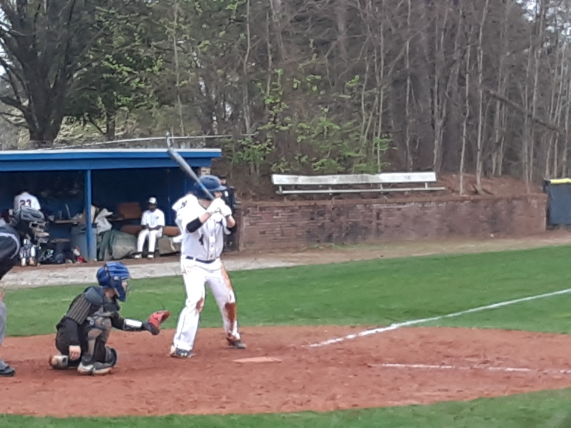
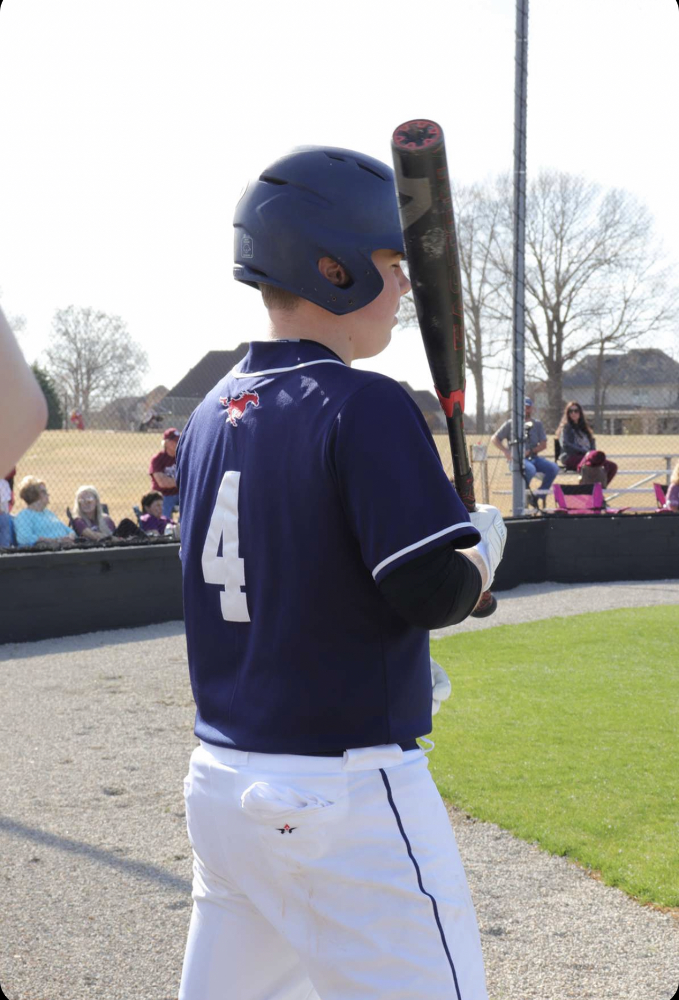
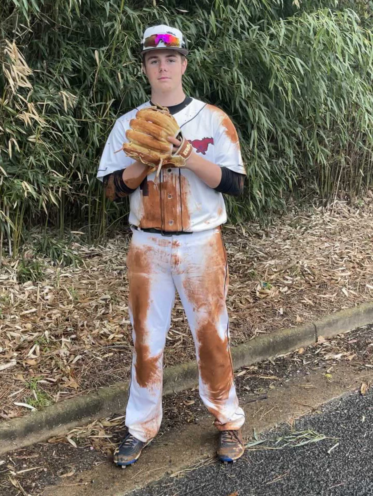

# Coding-1-Final
 These are the starter files for S2021 Coding 1

This website is intended to show off one of my favorite hobbies: baseball. Throughout the website, I show pictures of the game and describe why I have played it for so many years. Baseball has meant a lot to me over the years, so this website is dedicated to that passion. This website also goes into more detail about my playing career, inlcuding where I have played, my main positions, and my strengths and weaknesses. Anybody who comes across this website should know all about my personality and hobbies. The ultimate goal for the page is to help viewers get to know me a little bit better.

  

    

      

        
      

      

        
      

      

        
      

    

    <button class="carousel-control-prev" type="button" data-bs-target="#carouselExampleIndicators" data-bs-slide="prev">
      
      Previous
    </button>
    <button class="carousel-control-next" type="button" data-bs-target="#carouselExampleIndicators" data-bs-slide="next">
      
      Next
    </button>
  

  <!-- End of Image Slider -->